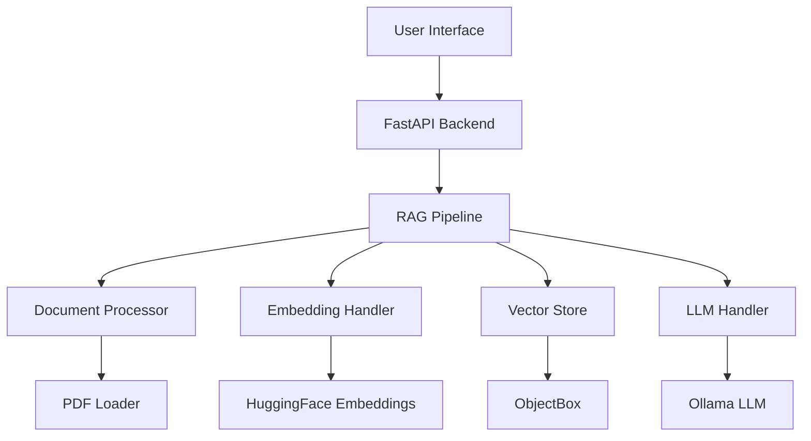

# RAG PDF Chatbot 🤖📚

A sophisticated Retrieval-Augmented Generation (RAG) chatbot that enables users to upload PDF documents and ask intelligent questions about their content. This enterprise-grade application operates completely offline using local LLMs and vector databases.

[](LICENSE)
[](https://www.python.org/)
[](https://reactjs.org/)

## 🌟 Key Features

- **🔒 Offline Operation**: Fully functional without internet connectivity using local Ollama models
- **🧠 Intelligent Document Processing**: Advanced PDF parsing and chunking algorithms
- **🔍 Semantic Search**: Vector-based similarity search using ObjectBox for precise retrieval
- **⚡ Real-time Responses**: Instant answers to document-specific questions
- **🎨 Modern UI**: Responsive React interface with Material-UI components
- **📦 Lightweight**: Embedded database and minimal dependencies

## 🏗️ Architecture Overview



## 🛠️ Technology Stack

### Backend
- **Framework**: [FastAPI](https://fastapi.tiangolo.com/) - High-performance, easy to learn, fast to code
- **RAG Orchestration**: [LangChain](https://www.langchain.com/) - Framework for developing applications with LLMs
- **Vector Database**: [ObjectBox](https://objectbox.io/) - Lightweight, high-performance embedded database
- **LLM Integration**: [Ollama](https://ollama.ai/) - Run LLMs locally with ease
- **Embeddings**: [HuggingFace Transformers](https://huggingface.co/) - State-of-the-art ML models
- **Document Processing**: [PyPDF](https://pypi.org/project/pypdf/) - Robust PDF manipulation

### Frontend
- **Framework**: [React](https://reactjs.org/) - Component-based JavaScript library
- **UI Library**: [Material-UI](https://mui.com/) - Comprehensive React component library
- **State Management**: React Hooks - Built-in React state management
- **HTTP Client**: [Axios](https://axios-http.com/) - Promise-based HTTP client

## 🚀 Quick Start

### Prerequisites
- Python 3.8+
- Node.js 14+
- Ollama (for local LLMs)

### Installation

1. **Clone the Repository**
   ```bash
   git clone https://github.com/saurabhjoshi065/rag-pdf-chatbot.git
   cd rag-pdf-chatbot
   ```

2. **Backend Setup**
   ```bash
   cd backend
   python -m venv venv
   source venv/bin/activate  # On Windows: venv\Scripts\activate
   pip install -r requirements.txt
   ```

3. **Frontend Setup**
   ```bash
   cd frontend
   npm install
   ```

4. **Ollama Setup**
   ```bash
   # Install Ollama from https://ollama.ai/
   # Pull a model (e.g., qwen3-coder)
   ollama pull qwen3-coder:480b-cloud
   ```

### Running the Application

1. **Start Backend Server**
   ```bash
   cd backend
   uvicorn main:app --reload
   ```
   The API will be available at `http://localhost:8000`

2. **Start Frontend Development Server**
   ```bash
   cd frontend
   npm start
   ```
   The application will be available at `http://localhost:3000`

## 📖 Usage Guide

### Uploading Documents
1. Navigate to the "Documents" section in the UI
2. Click "Upload PDF" and select your document
3. Wait for processing (document chunking and embedding)

### Asking Questions
1. Go to the "Chat" section
2. Type your question about the uploaded documents
3. Receive contextually relevant answers grounded in your documents

### API Endpoints
- `POST /api/documents/upload` - Upload PDF documents
- `POST /api/chat/query` - Submit questions about documents
- `GET /api/documents/list` - List all uploaded documents

## 🧪 Testing

### Backend Tests
```bash
cd backend
python -m pytest tests/
```

### Frontend Tests
```bash
cd frontend
npm test
```

## 📈 Performance Considerations

- **Chunk Size**: 1000 characters with 200 character overlap for optimal context retention
- **Embedding Model**: BGE-small for balance of speed and accuracy
- **Vector Database**: ObjectBox for low-latency similarity search
- **Memory Usage**: Optimized for consumer hardware (8GB RAM+ recommended)

## 🔧 Configuration

Environment variables can be set in `backend/.env`:
```env
OLLAMA_BASE_URL=http://localhost:11434
EMBEDDING_MODEL_NAME=BGE-small
CHUNK_SIZE=1000
CHUNK_OVERLAP=200
```


## 🙏 Acknowledgments

- Thanks to the open-source community for providing excellent libraries
- Inspired by enterprise document analysis solutions
- Built with ❤️ for developers and researchers
